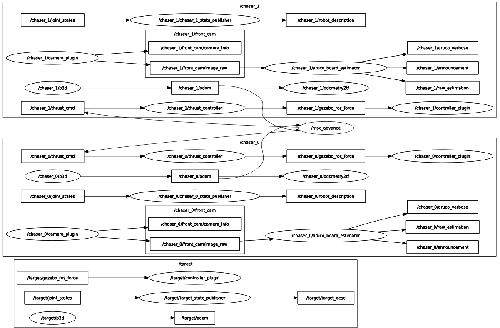

# Control Package

Contains a number of packages used for control of the chaser in the simulation.

## Thruster Packages

## Key Teleop

## PID Controller

## MPC Controllers

### Generic MPC Controller

### Advanced MPC Controller for pose matching

