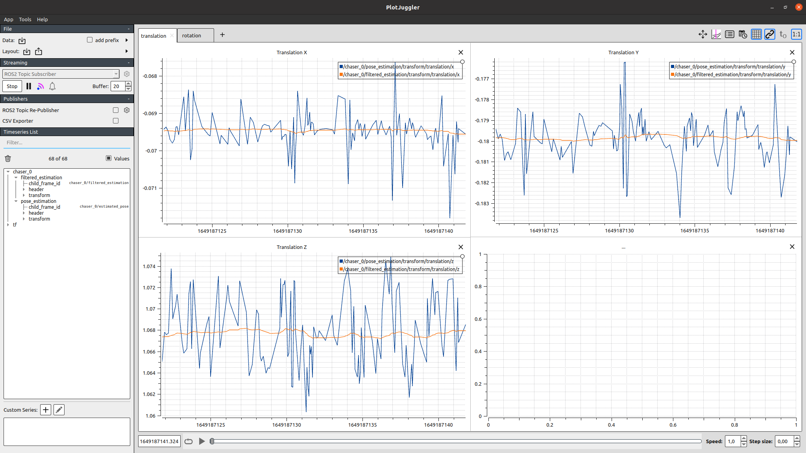

# Kalman Filters

This package contains nodes that implement kalman filters

## Filter Rigit Body

The filter_rigid_body node implements a kalman filter for a rigid body model. The node proceses a set of measurements for the estimation of the pose of the rigid body. Then publishes the filtered pose.

### Parameters

- **filter_type** (str): Type of filter to use. Possible values are:
  - **const_accel**: Constant Accelerations model
  - **const_vel**: Constant Velocities model
  - **~~const_accel_quat~~**: Constant Accelerations model, rotation in quaternion form
  - **~~const_vel_quat~~**: Constant Velocities model, rotation in quaternion form'
- **state_indexes** (str): The index of the state vector to use as measurements seperated by comma. For example `"0,1,2,9,10,11"` is used for `const_accel` (and rpy)
- **verbose** (int): Set verbosity level.
- **duration** (bool): If true, the node will outpu the duration of the calculations.

Example call:
```console
frank20a@ubuntu-ros:~/dev-ws$ ros2 run kalman filter_rigid_body --ros-args -r __ns:=/chaser_0 -p state_indexes:=0,1,2,6,7,8 -p filter_type:=const_vel
```
